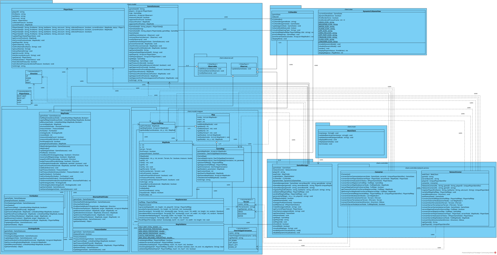
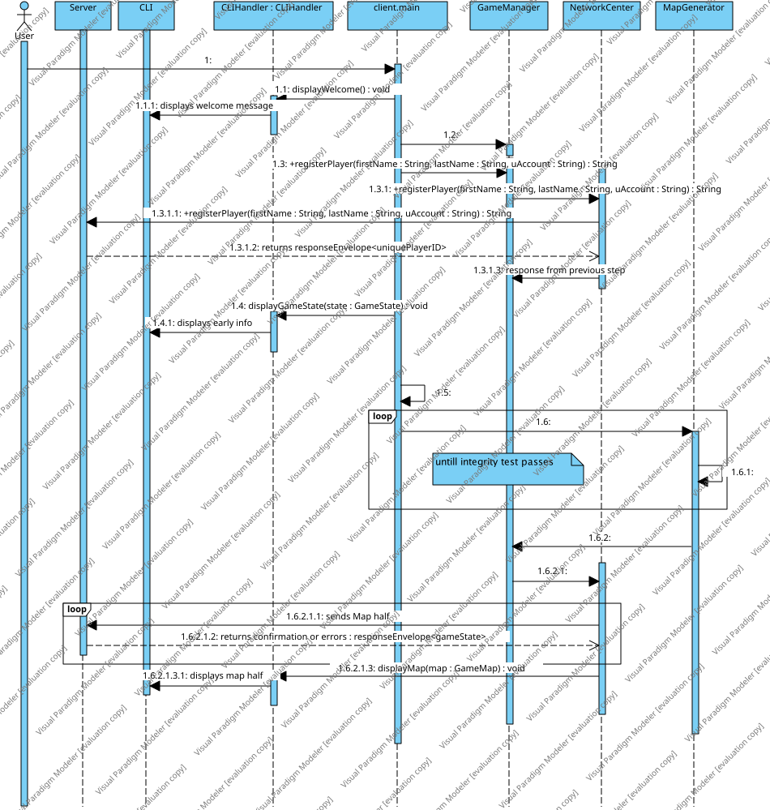
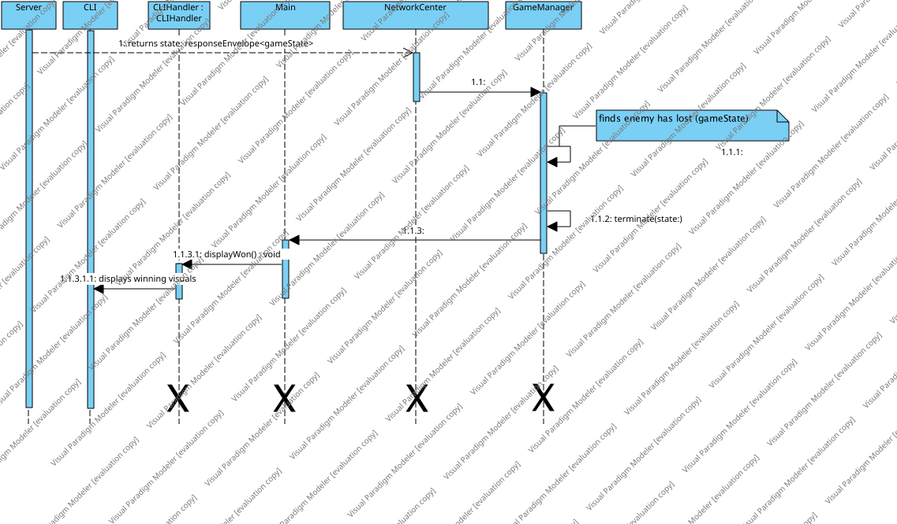

# Software Engineering I - Teilaufgabe 1 (Anforderungsanalyse und Planungsphase)

## Abgabedokument - Teilaufgabe 1 (Anforderungsanalyse und Planungsphase)

### Persönliche Daten, bitte vollständig ausfüllen:

- Nachname, Vorname: Mohammed Abdalrahman
- Matrikelnummer: 12136780
- E-Mail-Adresse: a12136780@unet.univie.ac.at
- Datum: 30.10.2025


## Aufgabe 1: Anforderungsanalyse

### Typ der Anforderung: funktional

**Anforderung 1**

- **Anforderung**: Autonomie - Nach der Ausführung des Clients-Programs muss der KI des Clients ohne menchliche Unterstützung am Spiel teilnehmen können.
- **Bezugsquelle**: [Spielidee, „Dieser erste Schritt wird noch von einem Menschen durchgeführt, alles danach erfolgt immer vollautomatisch durch eine Client/KI-Implementierung.“​]

**Anforderung 2**

- **Anforderung**: Netzwerkprotokollunterstützung: Beim Ausführen Des Clients muss die Kommunikation mit dem Server über das Netzwerkprotokoll erfolgen.
- **Bezugsquelle**: [Spielidee, „Die KIs werden von einem Server unterstützt, der
beide Clients koordiniert, Datenaustausch ermöglicht, als Schiedsrichter
auftritt und für Clients Daten speichert, aktualisiert und auswertet.“]

**Anforderung 3**

- **Anforderung**: Regeln der zufälligen Kartengenerierung : Der Client muss bei der zufälligen Generierung der Kartenhälften eine Reihe von Regeln einhalten.
- **Bezugsquelle**: [Spielidee, „Die KIs müssen während der Erstellung der
Kartenhälften eine Reihe von Regeln einhalten: Kartenhälften müssen zufällig
mit Algorithmen generiert und nicht statisch vorgegeben werden. Jede
Kartenhälfte muss mindestens 10% Bergfelder, 48% Wiesenfelder, 14%
Wasserfelder und 2% Burg beinhalten.“]

### Typ der Anforderung: nicht funktional

**Anforderung 4**

- **Anforderung**: Intuitive Spielvisualisierung: Die Darstellung der Karte und des
Spielzustands auf der CLI soll intuitiv und klar erkennbar sein.
- **Bezugsquelle**: [Spielidee, „Während des Spiels müssen die Karte und deren
bekannten Eigenschaften und wichtige Spielzustände von den Clients mittels
command-line interface (CLI) für Anwender nachvollziehbar visualisiert
werden.“]

**Anforderung 5**

- **Anforderung**: Hohe Reaktionsgeschwindigkeit: Der Client soll Spielaktionen
schneller als die maximale Bedenkzeit von 5 Sekunden ausführen können.
- **Bezugsquelle**: [Spielidee, „Für jede dieser rundenbasierten Spielaktion hat die
KI maximal 5 Sekunden Bedenkzeit.“]

**Anforderung 6**

- **Anforderung**: Grafische Aktualisierungen des Spielzustands: Der Client soll
regelmäßig grafische Updates über den aktuellen Zustand und die Fortschritte des Spiels bereitstellen.
- **Bezugsquelle**: [Spielidee, „Während des Spiels müssen die Karte und deren
bekannten Eigenschaften und wichtige Spielzustände von den Clients mittels
command-line interface (CLI) für Anwender nachvollziehbar visualisiert
werden.“]

### Typ der Anforderung: Designbedingung

**Anforderung 7**

- **Anforderung**: CLI-Interface: die CLI wird als Ausgabe-Interface für den Benutzer verwendet. 
- **Bezugsquelle**: [Spielidee, "Während des Spiels müssen die Karte und deren bekannten Eigenschaften und wichtige Spielzustände von den Clients mittels command-line interface (CLI) für Anwender nachvollziehbar visualisiert werden."]


## Aufgabe 2: Anforderungsdokumentation

- **Name**: Regeln der zufälligen Kartengenerierung
- **Beschreibung und Priorität**: Der Client muss beim Erzeugen seiner Kartenhälfte sicherstellen, dass diese zufällig generiert wird und dabei eine festgelegte Verteilung von Terrain-Typen enthält. Eine statische Vorgabe ist unzulässig. Die Kartenhälfte muss dabei bestimmte Mindestwerte an Geländearten sowie eine Burg enthalten.
- **Priorität**: Hoch
- **Relevante Anforderungen**: 
   - **Autonomie**: (Anforderung 1): Die Kartengenerierung erfolgt automatisch durch die KI des Clients.
   - **Netzwerkprotokollunterstützung**: (Anforderung 2): Die erzeugte Kartenhälfte wird im Anschluss via Netzwerkprotokoll an den Server gesendet.
- **Relevante Business Rules**:
- der maximale Größe des ganzen Program soll 1 GB nicht überschreiten (vom Test-Server zur Verfügung gestellter Speicherplatz).
- die Visualisierung des Spiels soll in eine Umgebung, die eine CLI Interface aufweist, erfolgen.
- Die Burg darf nur auf einem Wiesenfeld stehen.
- der Client muss  Nachrichtenaustasch mittls XML-Format unterstützen.
- bei der Registierung soll ein valides uAccount vorhanden sein.


### Impuls/Ergebnis – Typisches Szenario

**Vorbedingungen**

- Server wurde erfolgreich gestartet.
- Der Anwender hat valide URL, gameID und uAccount.

**Hauptsächlicher Ablauf**

1. **Impuls**: Der Anwender führt den Client aus.
   - **Ergebnis**: Client startet sich.
1. **Impuls**: Client beginnt die Kartengenerierung nach erfolgreicher Registrierung.
   - **Ergebnis**: Es wird eine leere Kartenhälfte erzeugt.
2. **Impuls**: Zufällige Verteilung von Terrains nach Regelwerk.
   - **Ergebnis**: Terrainfelder werden regelkonform gefüllt.
3. **Impuls**: Platzierung einer Burg auf einem geeigneten Wiesenfeld.
   - **Ergebnis**: Der Burg wird auf einem Wiesenfeld gesetzt.
4. **Impuls**: Validierung der Karte ('testIntegrity()').
   - **Ergebnis**: Die Karte besteht alle Validierungsregeln.
5. **Impuls**: Übertragung der Kartenhälfte an den Server.
   - **Ergebnis**: Server akzeptiert die Karte, keine Fehlermeldung.

**Nachbedingungen**

- Die gültige Kartenhälfte wurde erfolgreich vom Server angenommen, und durch eine 'ResponeEnvelope' bestätigt.
### Impuls/Ergebnis - Alternativszenario

**Vorbedingungen**

- Server wurde erfolgreich gestartet.
- Der Anwender hat valide URL, gameID und uAccount.

**Hauptsächlicher Ablauf**

1. **Impuls**: Der Anwender führt den Client aus.
   - **Ergebnis**: Client startet sich.
1. **Impuls**: Client beginnt die Kartengenerierung nach erfolgreicher Registrierung.
   - **Ergebnis**: Es wird eine leere Kartenhälfte erzeugt.
2. **Impuls**: Zufällige Verteilung von Terrains nach Regelwerk.
   - **Ergebnis**: Terrainfelder werden regelkonform gefüllt.
3. **Impuls**: Platzierung einer Burg auf einem geeigneten Wiesenfeld.
   - **Ergebnis**: der Burg wird auf einem Wiesenfeld gesetzt.
4. **Impuls**: 'testIntegrity()' hat festgestellt, dass der Burg leicht zu erreichen ist.
   - **Ergebnis**: Der Vorgang wiederholt sich, bis der 'testIntegrity' erfolgreich ist.
5. **Impuls**: Übertragung der Kartenhälfte an den Server.
   - **Ergebnis**: Server akzeptiert die Karte, keine Fehlermeldung.

**Nachbedingungen**

- Die gültige Kartenhälfte wurde nach einer kurzen Zeitverzögerung erfolgreich vom Server angenommen, und durch eine 'ResponeEnvelope' bestätigt.

### Impuls/Ergebnis - Fehlerfall

**Vorbedingungen:**

- Server wurde erfolgreich gestartet.
- Der Anwender hat valide URL, gameID und uAccount.
- Verbindung zum Server ist nach einer kurzen Zeit unterbrochen.

**Hauptsächlicher Ablauf:**

1. **Impuls**: Der Anwender führt den Client aus.
   - **Ergebnis**: Client startet sich.
1. **Impuls**: Client beginnt die Kartengenerierung nach erfolgreicher Registrierung.
   - **Ergebnis**: Es wird eine leere Kartenhälfte erzeugt.
2. **Impuls**: Zufällige Verteilung von Terrains nach Regelwerk.
   - **Ergebnis**: Terrainfelder werden regelkonform gefüllt.
3. **Impuls**: Platzierung einer Burg auf einem geeigneten Wiesenfeld.
   - **Ergebnis**: Der Burg wird auf einem Wiesenfeld gesetzt.
4. **Impuls**: Validierung der Karte ('testIntegrity()').
   - **Ergebnis**: Die Karte besteht alle Validierungsregeln.
5. **Impuls**: Übertragung der Kartenhälfte an den Server.
   - **Ergebnis**: Server antowrtet nicht für 5 Stunden (Skunden: 18000), Cleint terrminiert sich.

**Nachbedingungen:**

- Cliuent-Programm schließt sich. eine Fehlermeldung ('erorrHandler()') mit der Beschreibung "Server antwortet nicht" wird angezeigt. Der Anwender wird aufgefordert, die Verbindung zu überprüfen und den Client neu zu starten.

### Benutzergeschichten

- Als **Client KI** möchte ich die Kartenhälfte regelkonform und zufällig generieren, um die Spielregeln einzuhalten und vom Server akzeptiert zu werden.
- ALs **Server** möchte eine regelkonforme Kartenhälfte von beiden Clients erhalten, um das Spiel zu starten.

### Benutzerschnittstelle

```
Kartenhälfte generiert:
-----------------------
G G G G G G G G G G
G G G G M M M G G G
G W W G G G G G G G
G G G G G G G G G G
G G G G G G F G G G

Legende:
G = Grasfeld | W = Wasser | M = Berg | F = Burg
```

### Externe Schnittstellen

- **Server-Endpunkt zur Kartenübertragung:**  
  `POST http(s)://<domain>:<port>/games/<SpielID>/halfmaps`  
  XML-basierter Body mit `<playerHalfMap>` Element, inkl. Terraininformationen und Burgfeld.
- **Antwort:**  
  XML `<responseEnvelope>` mit `state=Okay` oder `state=Error`, sowie `exceptionMessage` bei Regelverstoß.

## Aufgabe 3: Architektur entwerfen, modellieren und validieren

### Klassendiagramm



### Sequenzdiagramm 1

Start der Clientanwendung bis (inklusive) sich der Client bewusst wird die Karte laut Netzwerkdokumentation verschicken zu dürfen.
 

### Sequenzdiagramm 2

Gegner ist gerade erst in ein Wasserfeld gelaufen. das direkt daran anschließende Verhalten des Clients bis zum (inklusive) endgültigen Ende der Clientausführung.


## Aufgabe 4: Quellen dokumentieren

Dokumentieren Sie Ihre Quellen. Dies ist für Sie wichtig, um die Einstufung einer Arbeit als Plagiat zu vermeiden. Inhalte, die direkt aus dem Moodle Kurs dieses Semesters der LV Software Engineering 1 stammen, können zur Vereinfachung weggelassen werden. Alle anderen Inhalte sind zu zitieren. Die Vorgabe des Studienpräses der Universität Wien lautet: *"Alle fremden Gedanken, die in die eigene Arbeit einfließen, müssen durch Quellenangaben belegt werden."*

### Aufgabe 1: Anforderungsanalyse

- **Kurzbeschreibung der Übernommenen Teile**: eigine Arebit aus Vorsemester. keine externen Quellen.
- **Quellen der Übernommenen Teile**: https://git01lab.cs.univie.ac.at/VU_Software_Engineering_1/Students/2025s/SE1_12136780/-/tree/master/Dokumentation/Teilaufgabe%201?ref_type=heads

### Aufgabe 2: Anforderungsdokumentation

- **Kurzbeschreibung der übernommenen Teile**: eigine Arebit aus Vorsemester. keine eexternen Quellen.
- **Quellen der übernommenen Teile**: https://git01lab.cs.univie.ac.at/VU_Software_Engineering_1/Students/2025s/SE1_12136780/-/tree/master/Dokumentation/Teilaufgabe%201?ref_type=heads

### Aufgabe 3: Architektur entwerfen, modellieren und validieren

- **Kurzbeschreibung der übernommenen Teile**: eigine Arebit aus Vorsemester. keine eexternen Quellen.
- **Quellen der übernommenen Teile**: https://git01lab.cs.univie.ac.at/VU_Software_Engineering_1/Students/2025s/SE1_12136780/-/tree/master/Dokumentation/Teilaufgabe%201?ref_type=heads